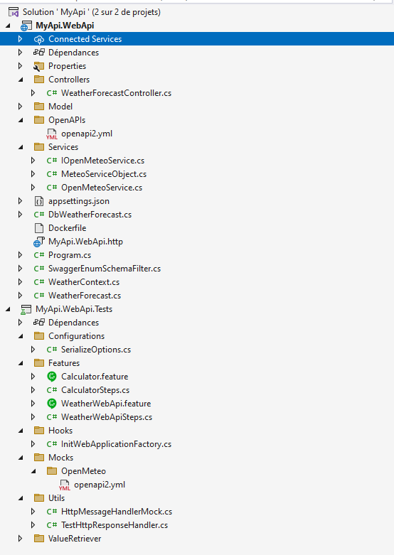
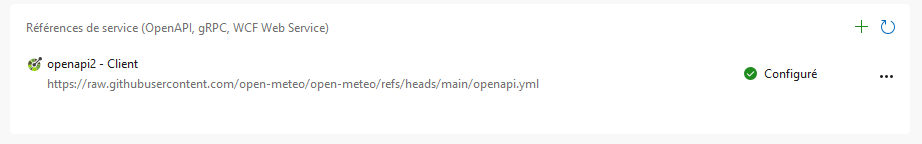
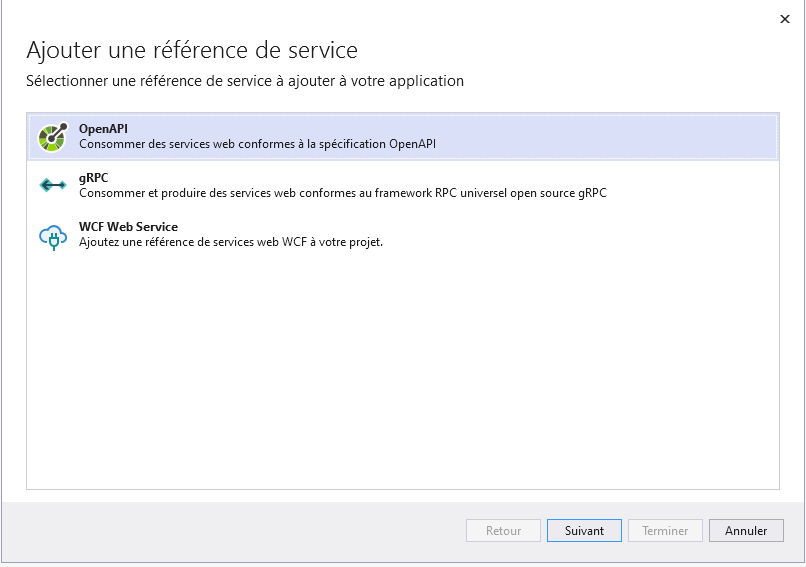
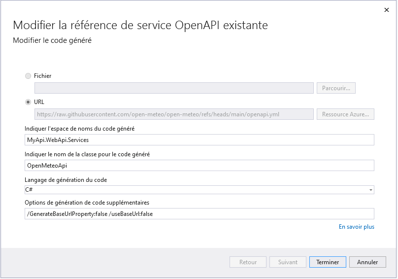
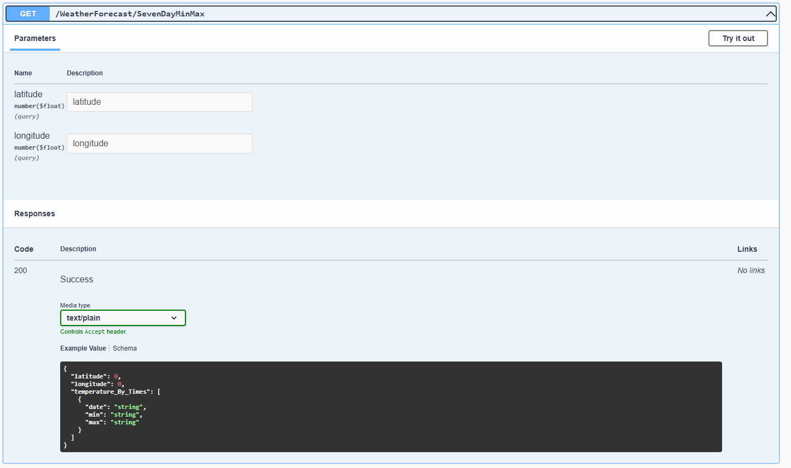

# Module 1: création du projet de test

## Qu'allons-nous faire?

Nous allons ajouter un service externe nommé [Open Meteo](https://open-meteo.com/en/docs), qui par la suite sera mocké dans les tests.

## Instructions

Démarrer avec le projet en jouant la commande suivante:

```
git clone https://github.com/CroquetMickael/RestDotNetIntegrationTests.git --branch feature/init
```

Ajouter un service connecté via Visual studio



Cliquer sur le +



Choisir OpenAPI



Puis remplir avec les informations suivante:

- URL: https://raw.githubusercontent.com/open-meteo/open-meteo/refs/heads/main/openapi.yml
- Espace de noms du code généré : MyApi.WebApi.Services
- C#
- Option : /GenerateBaseUrlProperty:false /useBaseUrl:false



## Usage du nouveau service

Dans le projet MyApi.WebApi, créer un dossier `Services` et ajouter 3 classes:

- OpenMeteoService
- MeteoServiceObject
- IOpenMeteoService

Dans le fichier **OpenMeteoService**, nous allons modifier le constructeur pour récupérer via injection de dépendance l'objet générer par les **Service Connecté** et nous allons aussi permettre l'implémentation de l'interface que vous venez de créer.

Nous irons modifier l'interface plus tard.

```cs
    public class OpenMeteoService : IOpenMeteoService
    {
        protected readonly OpenMeteoApi _openMeteo;

        public OpenMeteoService(OpenMeteoApi openMeteo)
        {
            _openMeteo = openMeteo;
        }
    }
```

Une fois cela fait, nous allons ajouter les 2 méthodes, la première sera en public et permettra d'effectuer l'appel au service REST via l'objet injecté.

La deuxiéme fera du mapping de donnée.

```cs
    public async Task<MeteoServiceObject> getMeteo(
        float latitude,
        float longitude)
    {
        var response = await _openMeteo.ForecastAsync([], [Anonymous2.Temperature_2m_max, Anonymous2.Temperature_2m_min], latitude, longitude, false, Temperature_unit.Celsius, null, null, "GMT", null);
        return mapOpenMeteoApiResponse(response);
    }

    private MeteoServiceObject mapOpenMeteoApiResponse(Response meteoApiResponse)
    {
        var meteoService = new MeteoServiceObject();
        var WeatherDataByDay = new List<Temperature>();
        meteoService.latitude = meteoApiResponse.Latitude;
        meteoService.longitude = meteoApiResponse.Longitude;
        WeatherData weatherData = JsonConvert.DeserializeObject<WeatherData>(meteoApiResponse.Daily.ToString());
        for (int i = 0; i < weatherData.Time.Count; i++)
        {
            Temperature temperature = new Temperature
            {
                min = $"{weatherData.Temperature_2m_min[i]}",
                max = $"{weatherData.Temperature_2m_max[i]}",
                date = weatherData.Time[i]
            };
            WeatherDataByDay.Add(temperature);
        }
        meteoService.temperature_By_Times = WeatherDataByDay;

        return meteoService;
    }

}

public class WeatherData
{
    public List<string> Time { get; set; }
    public List<double> Temperature_2m_max { get; set; }
    public List<double> Temperature_2m_min { get; set; }
}
```

Ce que nous avons fait ici, appeller le service via l'objet généré avec des données par défaut comme le fait d'avoir les degrés en Celsius, le mapping de la donnée ainsi qu'une classe pour permettre le mapping.

Vous verrez l'usage d'un type nommé `MeteoServiceObject` qui n'est pas présent dans cette classe, nous allons donc modifier / ajouter cette classe dans le même dossier.

```cs
namespace MyApi.WebApi.Services
{
    public class MeteoServiceObject
    {
        public double latitude { get; set; }

        public double longitude { get; set; }

        public IEnumerable<Temperature> temperature_By_Times  {get; set;}
    }

    public class Temperature
    {
        public string date { get; set; }

        public string min { get; set; }

        public string max { get; set; }
    }
}
```

Et maintenant, allons modifier le fichier `IOpenMeteoService` qui est simplement l'interface de notre service, que nous utiliserons.

```cs
namespace MyApi.WebApi.Services
{
    public interface IOpenMeteoService
    {
        Task<MeteoServiceObject> getMeteo(
            float latitude,
            float longitude);
    }
}
```

## Ajout de l'injection de dépendance

Dans le Program.cs, nous allons ajouter l'injection de dépendance pour notre service, cela est découpé en deux temps.

L'ajout de notre classe de service et son interface, puis l'ajout de l'HTTPClient pour notre service REST avec l'URL d'appel.

```cs
builder.Services.AddTransient<IOpenMeteoService, OpenMeteoService>();
builder.Services.AddHttpClient<OpenMeteoApi>(client =>
{
    client.BaseAddress = new Uri("https://api.open-meteo.com");
});
```

Pourquoi l'ajout de l'URL à la main, plus tard, quand nous voudrons tester, il faudra rajouter une URL custom, en mettant les 2 propriété suivante dans notre génération de la classe de **service connecté**:

`/GenerateBaseUrlProperty:false /useBaseUrl:false`

Cela désactive le paramétrage automatique de l'URL dans la classe généré, permettant de travailler librement et donc de mettre une URL custom et mocké.

## Modification des controllers existants

Nous avons besoin de modifier le constructeur de la classe des controllers pour que l'on puisse injecter le service.

```cs
    private readonly WeatherContext _weatherContext;
    private readonly IOpenMeteoService _openMeteoApi;

    public WeatherForecastController(WeatherContext weatherContext, IOpenMeteoService openMeteoApi)
    {
        _weatherContext = weatherContext;
        _openMeteoApi = openMeteoApi;
    }
```

Une fois tout cela fait, nous ajoutons la route lié à notre appel de service de notre côté.

```cs
    [HttpGet]
    [Route("SevenDayMinMax")]
    public async Task<MeteoServiceObject?> Get([FromQuery] MeteoObject meteo)
    {
        return await _openMeteoApi.getMeteo(meteo.latitude, meteo.longitude);
    }
```

## Test via le Swagger

Lancer le projet, vous arriverez sur le swagger:



Mettez les 2 propriétés que vous souhaitez dans la `latitude` et `longitude`.

Vous devriez avoir une réponse de ce style :

```json
{
  "latitude": 14,
  "longitude": 52,
  "temperature_By_Times": [
    {
      "date": "2025-01-27",
      "min": "22,9",
      "max": "24,2"
    },
    {
      "date": "2025-01-28",
      "min": "23,4",
      "max": "24,2"
    },
    {
      "date": "2025-01-29",
      "min": "23,7",
      "max": "24,4"
    },
    {
      "date": "2025-01-30",
      "min": "24",
      "max": "24,4"
    },
    {
      "date": "2025-01-31",
      "min": "24",
      "max": "24,7"
    },
    {
      "date": "2025-02-01",
      "min": "23",
      "max": "24,5"
    },
    {
      "date": "2025-02-02",
      "min": "23",
      "max": "23,9"
    }
  ]
}
```

[suivant >](../../Module%202%20lancement%20des%20appels%20http/doc/Readme.md)
