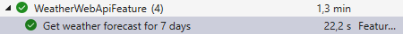

# Module 2: Ajout des tests du service meteo

Démarrer avec le projet du module précédent:

```
git clone https://github.com/CroquetMickael/RestDotNetIntegrationTests.git --branch feature/module1
```

## Modification du gherkin

Dans le fichier `WeatherWebApi.feature`, nous allons ajouter un scénario pour effectuer ce nouvel appel de service.

```Gherkin
Scenario: Get weather forecast for 7 days
    Given The days are:
        | Time       |
        | 2025-01-06 |
        | 2025-01-07 |
        | 2025-01-08 |
        | 2025-01-09 |
        | 2025-01-10 |
        | 2025-01-11 |
        | 2025-01-12 |
    Given The minimal temperatures are:
        | Min  |
        | 23.0 |
        | 24.3 |
        | 24.1 |
        | 23.9 |
        | 23.5 |
        | 23.5 |
        | 23.3 |
    Given The maximum temperatures are:
        | Max  |
        | 25.0 |
        | 25.2 |
        | 25.0 |
        | 24.5 |
        | 24.6 |
        | 24.5 |
        | 24.8 |
    Given The external service forecast respond
    When I make a GET request to 'weatherforecast/sevendayminmax' with:
        | Latitude | Longitude |
        | 14.2     | 52.2      |
    Then the response status code is '200'
    And the response with longitude '52.2' and latitude '14.2'
        | date       | min  | max  |
        | 2025-01-06 | 23   | 25   |
        | 2025-01-07 | 24,3 | 25,2 |
        | 2025-01-08 | 24,1 | 25   |
        | 2025-01-09 | 23,9 | 24,5 |
        | 2025-01-10 | 23,5 | 24,6 |
        | 2025-01-11 | 23,5 | 24,5 |
        | 2025-01-12 | 23,3 | 24,8 |
```

Puis dans le fichier `WeatherWebApi.cs`, nous ajoutons les steps associé à ce nouveau scénario.

Pour les Given:

```cs

    [Given("The days are:")]
    public void GivenTheDaysAre(Table table)
    {
        var days = table.Rows.Select(row => row["Time"]).ToArray();
        _scenarioContext.Add("days", days);

    }

    [Given("The minimal temperatures are:")]
    public void GivenTheMinimalTemperaturesAre(Table table)
    {
        var min = table.Rows.Select(row => row["Min"]).ToArray();
        _scenarioContext.Add("minimals", min);
    }

    [Given("The maximum temperatures are:")]
    public void GivenTheMaximumTemperaturesAre(Table table)
    {
        var max = table.Rows.Select(row => row["Max"]).ToArray();

        _scenarioContext.Add("maximums", max);

    }

    [Given("The external service forecast respond")]
    public void GivenTheExternalServiceForecastRespond()
    {
        _scenarioContext.TryGetValue("days", out String[] days);
        _scenarioContext.TryGetValue("minimals", out String[] minimals);
        _scenarioContext.TryGetValue("maximums", out String[] maximums);

        var mappedObject = new Dictionary<string, String[]>();
        mappedObject.Add("time", days);
        mappedObject.Add("temperature_2m_min", minimals);
        mappedObject.Add("temperature_2m_max", maximums);

        var httpResponse = new Response()
        {
            Daily = mappedObject,
        };

        var httpMessageResponse = new HttpResponseMessage()
        {
            StatusCode = HttpStatusCode.OK,
            Content = new StringContent(JsonSerializer.Serialize(httpResponse, SerializerOptions.SerializeOptions))
        };

        InitWebApplicationFactory.HttpMessageHandlerMeteoService.SetResponse(httpMessageResponse);

    }
```

Pour le `When`:

```cs
[When("I make a GET request to '(.*)' with:")]
public async Task WhenIMakeAGetRequestToWith(string endpoint, Table table)
{
    var client = _scenarioContext.Get<HttpClient>(InitWebApplicationFactory.HttpClientKey);
    NameValueCollection queryString = System.Web.HttpUtility.ParseQueryString(string.Empty);
    var meteoObject = table.CreateInstance<MeteoObject>();
    queryString.Add("latitude", meteoObject.latitude.ToString());
    queryString.Add("longitude", meteoObject.longitude.ToString());
    var url = $"{endpoint}?{queryString.ToString()}";
    _scenarioContext.Add(ResponseKey, await client.GetAsync(url));
}
```

Et pour finir le `Then`

```cs
[Then(@"the response with longitude '(.*)' and latitude '(.*)'")]
public async Task ThenTheResponseWithLongitudeAndLatitude(double longitude, double latitude, Table table)
{
    var response = await _scenarioContext.Get<HttpResponseMessage>(ResponseKey).Content.ReadAsStringAsync();

    var expected = table.CreateSet<Temperature>();
    var actual = JsonSerializer.Deserialize<MeteoServiceObject>(response, new JsonSerializerOptions
    {
        IgnoreReadOnlyProperties = true,
        PropertyNameCaseInsensitive = true
    });

    Assert.NotNull(actual);
    Assert.Equal(expected.Count(), actual.temperature_By_Times.Count());
    Assert.Equal(JsonSerializer.Serialize(expected), JsonSerializer.Serialize(actual.temperature_By_Times));
}
```

## Ajustement du InitWebApplicationFactory

### Ajout d'une classe de mock

Avant de modifier le InitWebApplicationFactory, nous allons créer une nouvelle classe dans le dossier `utils` nommé `HttpMessageHandlerMock.cs`

```cs
using System.Net;

namespace MyApi.WebApi.Tests.Utils
{

    public class HttpMessageHandlerMock : HttpMessageHandler
    {
        private HttpResponseMessage? _httpResponseMessage;

        public void SetResponse(HttpResponseMessage httpResponseMessage)
        {
            _httpResponseMessage = httpResponseMessage;
        }

        public void SetFailedAttemptsAndResponse(HttpResponseMessage httpResponseMessage, int nbError)
        {
            _httpResponseMessage = httpResponseMessage;
        }

        protected override Task<HttpResponseMessage> SendAsync(HttpRequestMessage request, CancellationToken cancellationToken)
        {
            if (_httpResponseMessage == null)
            {
                throw new InvalidOperationException("Error in request");
            }

            return Task.FromResult(_httpResponseMessage);
        }
    }

}
```

Cette classe met a disposition des méthodes comme:

- Le `SetResponse` pour modifier le body de la réponse
- Le `SendAsync` qui override celui de base et ainsi récupérer la réponsé mocké.

### InitWebApplicationFactory

Dans un premier temps, nous ajoutons une variable pour utiliser la classe de mock:

```cs
public static HttpMessageHandlerMock HttpMessageHandlerMeteoService { get; set; } = new();
```

Par la suite, nous allons modifier le hook de démarrage de nos tests pour permettre le mocking de notre service externe et donc de sa réponse.

```cs
    private static void ReplaceExternalServices(IServiceCollection services)
    {
        services.AddHttpClient<OpenMeteoApi>(client =>
        {
            client.BaseAddress = new Uri("http://toto");
        })
                .ConfigurePrimaryHttpMessageHandler(() =>
                {
                    return HttpMessageHandlerMeteoService;
                });
    }
```

Cette nouvelle méthode va ajouter le HttpClient avec une URI Custom et utilisé notre version du sendAsync et mettre à disposition la méthode `SetResponse` que nous utilisons dans nos tests.

Et pour finir, nous ajoutons cette méthode `ReplaceExternalServices` dans notre `BeforeScenario`

```cs
 [BeforeScenario]
    public async Task BeforeScenario(ScenarioContext scenarioContext, IObjectContainer objectContainer)
    {
        _msSqlContainer = new MsSqlBuilder().Build();
        await _msSqlContainer.StartAsync();
        await PopulateDatabaseAsync();
        await InitializeRespawnAsync();
        var application = new WebApplicationFactory<Program>().WithWebHostBuilder(builder =>
        {
            builder.ConfigureTestServices(services =>
            {
                RemoveLogging(services);
                ReplaceDatabase(services, objectContainer);
                ReplaceExternalServices(services);
            });
        });

        var client = application.CreateClient();

        scenarioContext.TryAdd(HttpClientKey, client);
        scenarioContext.TryAdd(ApplicationKey, application);
    }
```

Lancez vos tests et vous devriez normalement avoir ce résultat:



[suivant >](../../Module%202%20lancement%20des%20appels%20http/doc/Readme.md)
