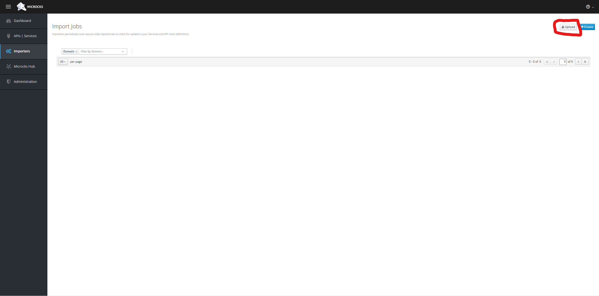
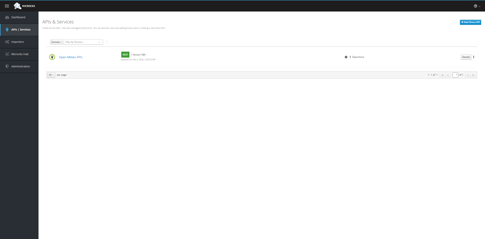
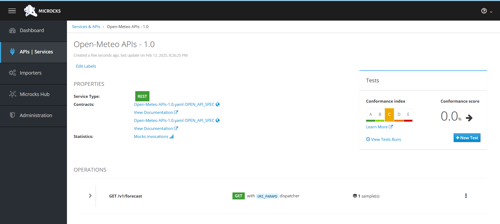

# Module 3: Usage de Microcks

Démarrer avec le projet du module précédent:

```
git clone https://github.com/CroquetMickael/RestDotNetIntegrationTests.git --branch feature/module2
```

## Préambule

Dans ce module, nous allons découvrir et utiliser Microcks pour la gestion de nos mocks API. Pour que cela fonctionne, nous aurons besoin de `Docker` ou `Podman` car Microcks propose principalement des images docker pour son usage prévu en CI/CD ou en CAAS (Container As A Service).

Microcks bien que présenté ici en C#/.Net est utilisable en JAVA, NODE

## Démarrage du Docker Compose

### Podman

Pour Podman, pensez à démarrer votre machine `podman machine start` et lancer la commande `podman-compose up -d` dans le dossier `MyApi`.

### Docker

Démarrer votre Docker Desktop et lancer la commande `docker-compose up -d` dans le dossier `MyApi`.

Lancer ensuite votre navigateur sur l'URL [http://localhost:8585](http://localhost:8585).

Vous devriez arriver sur cette page:


### Que c'est-il passé ?

Microcks démarre un serveur pour fournir un environnement dans lequel les APIs simulées (mocks) peuvent être hébergées et accessibles. Cela peut être utilisé pour plusieurs raison :

1. **Accessibilité des Mocks** : En démarrant un serveur, Microcks permet aux développeurs d'accéder aux mocks d'API via des endpoints HTTP. Cela permet aux utilisateurs de tester leurs applications comme s'ils interagissaient avec une API réelle.

2. **Tests Locaux** : Un serveur local offre aux développeurs la possibilité de tester leurs applications sans dépendre d'une API externe, ce qui est particulièrement utile pour le développement local, les tests unitaires, et les tests d'intégration.

3. **Simulation du Comportement de l'API** : Le serveur peut simuler des comportements spécifiques de l'API, comme des réponses réussies, des erreurs ou des délais, permettant aux développeurs de vérifier comment leur application réagit dans différentes situations.

4. **Collaboration** : En ayant un serveur en cours d'exécution, les membres de l'équipe peuvent accéder aux mocks et les tester facilement. Cela facilite la collaboration entre les développeurs, les testeurs et les parties prenantes.

5. **Intégration dans des Pipelines CI/CD** : Dans le cadre d'un processus d'intégration continue et de déploiement continu (CI/CD), un serveur peut être utilisé pour effectuer des tests automatisés sur les mocks d'API, garantissant ainsi que les modifications apportées au code n'introduisent pas de régressions.

En résumé, le démarrage d'un serveur par Microcks permet de créer un environnement de test réaliste et accessible pour les développeurs, ce qui améliore l'efficacité du développement et la qualité des applications.

## Modification d'un fichier openapi

Pour que Microcks fonctionne et surcharge la référence de votre API avec des examples qui lui sont propre, nous allons donc créer un nouveau fichier `openapi.yml` qui nous sera propre et qui sera réutilisé pour nos mocks dans nos test plus tard.

### Qu'est-ce qu'OpenAPI ?

OpenAPI est une spécification utilisée pour décrire les API RESTful. Elle permet de définir de manière standardisée les endpoints d'une API, les méthodes HTTP supportées, les paramètres, les formats de réponse, et bien plus encore.

L'objectif principal d'OpenAPI est de faciliter la compréhension, l'utilisation et l'intégration des API par les développeurs.

#### Caractéristiques principales

- **Documentation claire** : OpenAPI permet de générer automatiquement la documentation de l'API, ce qui rend son utilisation plus intuitive.
- **Interopérabilité** : Grâce à sa spécification standard, les outils et bibliothèques peuvent facilement interagir avec les APIs décrites en OpenAPI.
- **Génération de code** : À partir d'une définition OpenAPI, il est possible de générer du code client ou serveur, ce qui accélère le développement.

**Pour en savoir plus**
Pour approfondir vos connaissances sur OpenAPI, vous pouvez consulter les ressources suivantes :

- [Documentation officielle d'OpenAPI](https://swagger.io/specification/)
- [Guide pratique sur OpenAPI](https://learn.openapis.org)
- [Tutoriel sur Swagger et OpenAPI](https://grafikart.fr/tutoriels/swagger-openapi-php-1160)

Créons un dossier `Mocks` et un sous dossier `OpenMeteo` dans le projet de test .net à la racine.

Dupliquer le `.yml` qui est sur cette URL: [https://raw.githubusercontent.com/open-meteo/open-meteo/refs/heads/main/openapi.yml](https://raw.githubusercontent.com/open-meteo/open-meteo/refs/heads/main/openapi.yml) dans un fichier que vous nommerez `openmeteomocks.yml`.

Une fois cela fait, nous modifions le fichier pour y rajouter des examples:

<details>
<summary>Schema OpenAPI</summary>
<br>

```yml
openapi: 3.0.0
info:
  title: Open-Meteo APIs
  description: "Open-Meteo offers free weather forecast APIs for open-source developers and non-commercial use. No API key is required."
  version: "1.0"
  contact:
    name: Open-Meteo
    url: https://open-meteo.com
    email: info@open-meteo.com
  license:
    name: Attribution 4.0 International (CC BY 4.0)
    url: https://creativecommons.org/licenses/by/4.0/
  termsOfService: https://open-meteo.com/en/features#terms
paths:
  /v1/forecast:
    servers:
      - url: https://api.open-meteo.com
    get:
      tags:
        - Weather Forecast APIs
      summary: 7 day weather forecast for coordinates
      description: 7 day weather variables in hourly and daily resolution for given WGS84 latitude and longitude coordinates. Available worldwide.
      parameters:
        - name: hourly
          in: query
          explode: false
          schema:
            type: array
            items:
              type: string
              enum:
                - temperature_2m
                - relative_humidity_2m
                - dew_point_2m
                - apparent_temperature
                - pressure_msl
                - cloud_cover
                - cloud_cover_low
                - cloud_cover_mid
                - cloud_cover_high
                - wind_speed_10m
                - wind_speed_80m
                - wind_speed_120m
                - wind_speed_180m
                - wind_direction_10m
                - wind_direction_80m
                - wind_direction_120m
                - wind_direction_180m
                - wind_gusts_10m
                - shortwave_radiation
                - direct_radiation
                - direct_normal_irradiance
                - diffuse_radiation
                - vapour_pressure_deficit
                - evapotranspiration
                - precipitation
                - weather_code
                - snow_height
                - freezing_level_height
                - soil_temperature_0cm
                - soil_temperature_6cm
                - soil_temperature_18cm
                - soil_temperature_54cm
                - soil_moisture_0_1cm
                - soil_moisture_1_3cm
                - soil_moisture_3_9cm
                - soil_moisture_9_27cm
                - soil_moisture_27_81cm
        - name: daily
          in: query
          schema:
            type: array
            items:
              type: string
              enum:
                - temperature_2m_max
                - temperature_2m_min
                - apparent_temperature_max
                - apparent_temperature_min
                - precipitation_sum
                - precipitation_hours
                - weather_code
                - sunrise
                - sunset
                - wind_speed_10m_max
                - wind_gusts_10m_max
                - wind_direction_10m_dominant
                - shortwave_radiation_sum
                - uv_index_max
                - uv_index_clear_sky_max
                - et0_fao_evapotranspiration
          examples:
            minmaxdaily:
              value:
                - temperature_2m_min
                - temperature_2m_max
        - name: latitude
          in: query
          required: true
          description: "WGS84 coordinate"
          schema:
            type: number
            format: number
          examples:
            minmaxdaily:
              value: 14.2
        - name: longitude
          in: query
          required: true
          description: "WGS84 coordinate"
          schema:
            type: number
            format: number
          examples:
            minmaxdaily:
              value: 52.2
        - name: current_weather
          in: query
          schema:
            type: boolean
        - name: temperature_unit
          in: query
          schema:
            type: string
            default: celsius
            enum:
              - celsius
              - fahrenheit
        - name: wind_speed_unit
          in: query
          schema:
            type: string
            default: kmh
            enum:
              - kmh
              - ms
              - mph
              - kn
        - name: timeformat
          in: query
          description: If format `unixtime` is selected, all time values are returned in UNIX epoch time in seconds. Please not that all time is then in GMT+0! For daily values with unix timestamp, please apply `utc_offset_seconds` again to get the correct date.
          schema:
            type: string
            default: iso8601
            enum:
              - iso8601
              - unixtime
        - name: timezone
          in: query
          description: If `timezone` is set, all timestamps are returned as local-time and data is returned starting at 0:00 local-time. Any time zone name from the [time zone database](https://en.wikipedia.org/wiki/List_of_tz_database_time_zones) is supported.
          schema:
            type: string
        - name: past_days
          in: query
          description: If `past_days` is set, yesterdays or the day before yesterdays data are also returned.
          schema:
            type: integer
            enum:
              - 1
              - 2
      responses:
        200:
          description: OK
          content:
            application/json:
              schema:
                type: object
                properties:
                  latitude:
                    type: number
                    example: 52.52
                    description: WGS84 of the center of the weather grid-cell which was used to generate this forecast. This coordinate might be up to 5 km away.
                  longitude:
                    type: number
                    example: 13.419.52
                    description: WGS84 of the center of the weather grid-cell which was used to generate this forecast. This coordinate might be up to 5 km away.
                  elevation:
                    type: number
                    example: 44.812
                    description: The elevation in meters of the selected weather grid-cell. In mountain terrain it might differ from the location you would expect.
                  generationtime_ms:
                    type: number
                    example: 2.2119
                    description: Generation time of the weather forecast in milli seconds. This is mainly used for performance monitoring and improvements.
                  utc_offset_seconds:
                    type: integer
                    example: 3600
                    description: Applied timezone offset from the &timezone= parameter.
                  hourly:
                    type: object
                    description: For each selected weather variable, data will be returned as a numbering point array. Additionally a `time` array will be returned with ISO8601 timestamps.
                  hourly_units:
                    type: object
                    additionalProperties:
                      type: string
                    description: For each selected weather variable, the unit will be listed here.
                  daily:
                    type: object
                    description: For each selected daily weather variable, data will be returned as a numbering point array. Additionally a `time` array will be returned with ISO8601 timestamps.
                  daily_units:
                    type: object
                    additionalProperties:
                      type: string
                    description: For each selected daily weather variable, the unit will be listed here.
                  current_weather:
                    type: object
                    description: "Current weather conditions with the attributes: time, temperature, wind_speed, wind_direction and weather_code"
              examples:
                minmaxdaily:
                  value:
                    latitude: 14.2
                    longitude: 52.2
                    daily:
                      time:
                        - "2025-01-06"
                        - "2025-01-07"
                        - "2025-01-08"
                        - "2025-01-09"
                        - "2025-01-10"
                        - "2025-01-11"
                        - "2025-01-12"
                      temperature_2m_min:
                        - "23.0"
                        - "24.3"
                        - "24.1"
                        - "23.9"
                        - "23.5"
                        - "23.5"
                        - "23.3"
                    temperature_2m_max:
                      - "25.0"
                      - "25.2"
                      - "25.0"
                      - "24.5"
                      - "24.6"
                      - "24.5"
                      - "24.8"
        400:
          description: Bad Request
          content:
            application/json:
              schema:
                type: object
                properties:
                  error:
                    type: boolean
                    description: Always set true for errors
                  reason:
                    type: string
                    description: Description of the error
                    example: "Latitude must be in range of -90 to 90°. Given: 300"
components:
  schemas:
    HourlyResponse:
      type: object
      required:
        - time
      properties:
        time:
          type: array
          items:
            type: string
        temperature_2m:
          type: array
          items:
            type: number
        relative_humidity_2m:
          type: array
          items:
            type: number
        dew_point_2m:
          type: array
          items:
            type: number
        apparent_temperature:
          type: array
          items:
            type: number
        pressure_msl:
          type: array
          items:
            type: number
        cloud_cover:
          type: array
          items:
            type: number
        cloud_cover_low:
          type: array
          items:
            type: number
        cloud_cover_mid:
          type: array
          items:
            type: number
        cloud_cover_high:
          type: array
          items:
            type: number
        wind_speed_10m:
          type: array
          items:
            type: number
        wind_speed_80m:
          type: array
          items:
            type: number
        wind_speed_120m:
          type: array
          items:
            type: number
        wind_speed_180m:
          type: array
          items:
            type: number
        wind_direction_10m:
          type: array
          items:
            type: number
        wind_direction_80m:
          type: array
          items:
            type: number
        wind_direction_120m:
          type: array
          items:
            type: number
        wind_direction_180m:
          type: array
          items:
            type: number
        wind_gusts_10m:
          type: array
          items:
            type: number
        shortwave_radiation:
          type: array
          items:
            type: number
        direct_radiation:
          type: array
          items:
            type: number
        direct_normal_irradiance:
          type: array
          items:
            type: number
        diffuse_radiation:
          type: array
          items:
            type: number
        vapour_pressure_deficit:
          type: array
          items:
            type: number
        evapotranspiration:
          type: array
          items:
            type: number
        precipitation:
          type: array
          items:
            type: number
        weather_code:
          type: array
          items:
            type: number
        snow_height:
          type: array
          items:
            type: number
        freezing_level_height:
          type: array
          items:
            type: number
        soil_temperature_0cm:
          type: array
          items:
            type: number
        soil_temperature_6cm:
          type: array
          items:
            type: number
        soil_temperature_18cm:
          type: array
          items:
            type: number
        soil_temperature_54cm:
          type: array
          items:
            type: number
        soil_moisture_0_1cm:
          type: array
          items:
            type: number
        soil_moisture_1_3cm:
          type: array
          items:
            type: number
        soil_moisture_3_9cm:
          type: array
          items:
            type: number
        soil_moisture_9_27cm:
          type: array
          items:
            type: number
        soil_moisture_27_81cm:
          type: array
          items:
            type: number
    DailyResponse:
      type: object
      properties:
        time:
          type: array
          items:
            type: string
        temperature_2m_max:
          type: array
          items:
            type: number
        temperature_2m_min:
          type: array
          items:
            type: number
        apparent_temperature_max:
          type: array
          items:
            type: number
        apparent_temperature_min:
          type: array
          items:
            type: number
        precipitation_sum:
          type: array
          items:
            type: number
        precipitation_hours:
          type: array
          items:
            type: number
        weather_code:
          type: array
          items:
            type: number
        sunrise:
          type: array
          items:
            type: number
        sunset:
          type: array
          items:
            type: number
        wind_speed_10m_max:
          type: array
          items:
            type: number
        wind_gusts_10m_max:
          type: array
          items:
            type: number
        wind_direction_10m_dominant:
          type: array
          items:
            type: number
        shortwave_radiation_sum:
          type: array
          items:
            type: number
        uv_index_max:
          type: array
          items:
            type: number
        uv_index_clear_sky_max:
          type: array
          items:
            type: number
        et0_fao_evapotranspiration:
          type: array
          items:
            type: number
      required:
        - time
    CurrentWeather:
      type: object
      properties:
        time:
          type: string
        temperature:
          type: number
        wind_speed:
          type: number
        wind_direction:
          type: number
        weather_code:
          type: integer
      required:
        - time
        - temperature
        - wind_speed
        - wind_direction
        - weather_code
```

</details>
<br>
Le fichier étant un peu grand, faites une recherche sur minmaxdaily pour voir les modifications apporté.

### Usage du fichier dans Microcks

Retourner sur l'URL de Microcks et cliquer sur `Importers` et cliquer sur `upload`.



Une fois fait, choisisser votre fichier.

Allez ensuite dans `API | Services`, vous devriez voir votre api custom.



Rentrer dedans et vous devriez voir 1 définition d'appel dans les opérations.



Cliquer sur la définition de votre route API, vous pouvez ainsi copier l'URL fournit, renseignez la dans votre navigateur, vous aurez alors un retour API avec les données que nous avons fournit.

### Tester la définition customiser avec la vrai API.

Le point positif de Microcks en dehors de fournir un serveur qui répond des mocks prédéfinit au seins des tests et de permettre de comparé le retour d'une API vs la définition custom que vous lui avez donné.

Si votre API ne répond pas à la norme openAPI, le test passera en erreur, nous allons donc tester que notre définition est valide.

Pour ce faire cliquer sur `New Test`:

Dans test Endpoint, nous mettrons l'URL du service : https://api.open-meteo.com

Dans Runner, vous avez 2 possibilité:

- HTTP: Il lancera un vrai appel API et il vérifie simplement que le code de retour est équivalent avec votre mock.

- OPEN API SCEMA: Il effectue aussi un appel et il vérifie que la réponse est équivalente a ce que vous lui avez proposé dans votre mock.

Tentez les deux !

Un repo contenant une solution est disponible ici:

```
git clone https://github.com/CroquetMickael/RestDotNetIntegrationTests.git --branch feature/module3
```

[suivant >](../../modules/Module%204%20Ajustement%20des%20tests%20pour%20usage%20de%20Microcks/readme.md)
