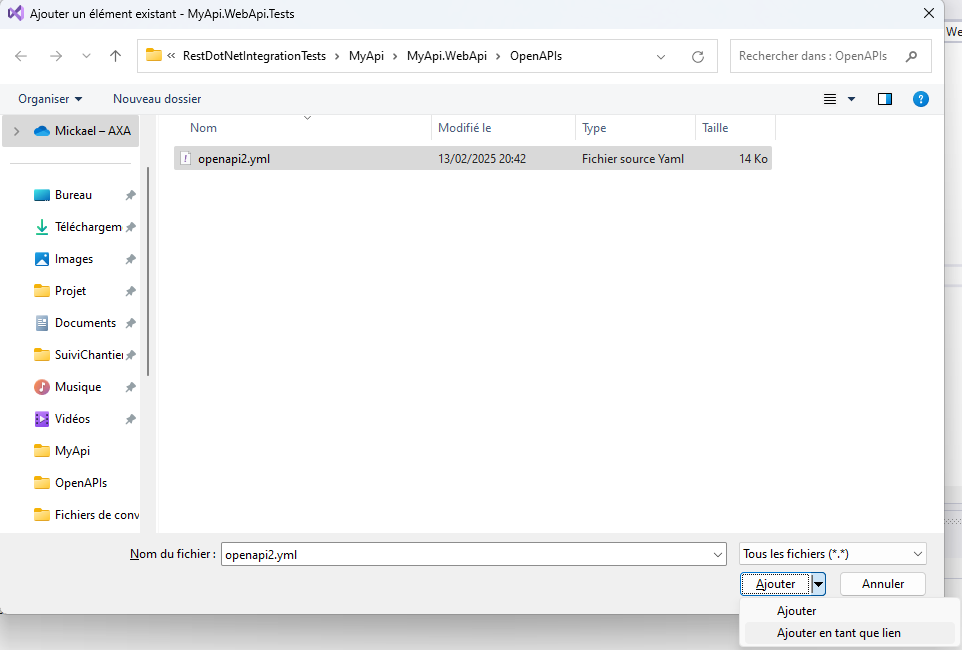

# Module 4: Ajustement des tests pour usage de Microcks

Démarrer avec le projet du module précédent:

```
git clone https://github.com/CroquetMickael/RestDotNetIntegrationTests.git --branch feature/module3
```

## Préambule

Vérifier que vous avez bien `Podman` ou `Docker` de lancer pour pouvoir continuer ce Module.

### Faire des symlink des fichiers

Faire clic droit sur `MyAPI.WebAPI.Tests` et faire ajouter `élément existant`:


Sélectionner le fichier et faites le choix d'ajouter un lien vers le fichier.



Cela permettra de simplifier une fonction que nous allons intégrer plus tard.

## Ajout du package Microcks et usage du test Container

Dans un premier temps, vous devriez installer Microcks dans la solution de test, le package Nuget ce nomme : `Microcks.Testcontainers` pour un soucis de praticité, cela est déjà fait, vous avez juste à passer à la suite 😊.

Une fois cela fait, nous allons modifier notre hook de démarrage, nous allons ajouter 2 paramètres, un public, l'autre privée qui seront utiliser pour démarrer le test container de Microcks.

```cs
internal class InitWebApplicationFactory
{
    ***
    private MicrocksContainer _microcksContainer = null!;
    internal Uri _microcksUrl;
```

Une fois cela fait, nous allons créer une nouvelle méthode privée pour démarrer le test Container:

```cs
 private async Task CreateApiTestcontainer()
    {
        _microcksContainer = new MicrocksBuilder()
           .WithImage("quay.io/microcks/microcks-uber:1.10.0")
            .WithMainArtifacts("openapi.yml")
            .WithSecondaryArtifacts("Mocks\\OpenMeteo\\openMeteoMocks.yml")
           .Build();
        await _microcksContainer.StartAsync();
        _microcksUrl = _microcksContainer.GetRestMockEndpoint("Open-Meteo APIs", "1.0/v1");
    }
```

### Que fait cette fonction ?

- `.WithImage("quay.io/microcks/microcks-uber:1.10.0")`: Cela permet de définir l'image docker que l'ont va utiliser dans nos tests, il est souvent conseiller d'éviter de mettre `latest` dans les tests pour éviter d'avoir des soucis en cas de monté de version non prévu.

#### Les artifacts

Dans Microcks, les termes **primaryArtifact** et **secondaryArtifact** se réfèrent à des types d'artéfacts utilisés pour définir et simuler des APIs. Voici une explication des différences entre ces deux concepts :

#### Primary Artifact

Définit par `WithMainArtifacts` dans notre fonction.

- **Rôle** : Cet artéfact est utilisé pour générer les mocks d'API et pour effectuer des tests basés sur les spécifications qu'il contient. Il sert de base pour la simulation et le comportement attendu de l'API.
- **Importance** : C'est l'élément de base de notre API, il définit le contrat de service.

#### Secondary Artifact

Définit par `WithSecondaryArtifacts` dans notre fonction.

- **Rôle** : Ces artéfacts secondaires peuvent être utilisés pour fournir des données de test, des schémas supplémentaires, ou des configurations spécifiques qui ne sont pas couvertes par le primaryArtifact. Ils permettent d'ajouter de la richesse et de la diversité aux simulations.
- **Importance** : Bien qu'ils ne soient pas essentiels au fonctionnement de l'API simulée, les secondaryArtifacts peuvent améliorer les tests et les interactions en fournissant des contextes ou des données supplémentaires.

### En résumé

- **Primary Artifact** : Artéfact principal qui définit l'API et sert de base pour les mocks et les tests.
- **Secondary Artifact** : Artéfact supplémentaire qui enrichit ou complète le primaryArtifact, offrant des données ou des configurations supplémentaires.

#### Démarrer le container et récupérer l'URL

```cs
await _microcksContainer.StartAsync();
Uri _microcksUrl = _microcksContainer.GetRestMockEndpoint("Open-Meteo APIs", "1.0/v1");
```

Ces deux lignes font principalement 2 chose:

- La première ligne démarre le test container de Microcks.
- La deuxiéme ligne récupére l'URI de notre service, en passant le Endpoint que l'on souhaite, ce endpoint est basé sur le openapi.yml que l'on a fournit dans la section `info` avec la propriété `title`

```yml
openapi: 3.0.0
info:
  title: Open-Meteo APIs
  description: "Open-Meteo offers free weather forecast APIs for open-source developers and non-commercial use. No API key is required."
  version: "1.0"
```

### C'est quoi un test container ?

Un test container est une méthode de test qui utilise des containers pour exécuter des tests d'application dans un environnement isolé et reproductible. Cela permet de simuler des environnements de production et de s'assurer que le code fonctionne correctement avant d'être déployé.

#### Avantages des Test Containers

1. **Isolation** : Chaque test s'exécute dans un environnement propre, évitant les interférences entre les tests.
2. **Reproductibilité** : Les tests peuvent être exécutés dans le même environnement à chaque fois, ce qui réduit les problèmes liés à des différences d'environnement.
3. **Scalabilité** : Les containers peuvent être facilement créés et détruits, permettant de faire tourner des tests en parallèle.
4. **Intégration facile** : Ils s'intègrent bien avec les outils de CI/CD, facilitant l'automatisation des tests.

## Modifier le HTTP Client de test pour utiliser la nouvelle URL

Nous devons aussi modifier notre `ReplaceExternalServices` pour que notre HttpClient contacte maintenant, Microcks.

```cs
  private static void ReplaceExternalServices(IServiceCollection services, Uri microcksUrl)
    {
        services.AddHttpClient<OpenMeteoApi>(client =>
        {
            client.BaseAddress = microcksUrl;
        });
    }
```

Comme vous pouvez constater, nous avons retirer le `HttpMessageHandlerMeteoService`, cela veut maintenant dire que `.net` va utiliser directement l'url fournit par nous même.

Et pour finir, nous devons démarrer le container au début de chaque scénario, le `BeforeScenario` est prévu pour ça:

```cs
[BeforeScenario]
    public async Task BeforeScenario(ScenarioContext scenarioContext, IObjectContainer objectContainer)
    {
        await CreateApiTestcontainer();
        var application = new WebApplicationFactory<Program>().WithWebHostBuilder(builder =>
        {
            builder.ConfigureTestServices(services =>
            {
                RemoveLogging(services);
                ReplaceExternalServices(services, _microcksUrl);
            });
        });

    var client = application.CreateClient();

        scenarioContext.TryAdd(HttpClientKey, client);
        scenarioContext.TryAdd(ApplicationKey, application);
    }
```

Vous pouvez lancer les tests, Vous aurez normalement des tests en erreur.

## Correction de l'erreur

Microcks a une particularité en mode test Container, il est très rigoureux sur le fait que le document doit être à l'exactitude de vos paramètres d'entrée dans l'URL, que ce soit par les `path params` ou les `query params`.

De ce fait, dans notre précédent schéma Open API, nous n'avions pas pris en compte les paramètres suivant :

- current_weather
- temperature_unit
- timezone

Il faut donc rajouter des examples dans notre `openMeteoMocks.yml` pour ces trois paramêtres pour notre `minmaxdaily` avec les valeurs suivante:

- current_weather = false
- temperature_unit = celsius
- timezone = GMT.

<details>
<summary>Correction</summary>
<br>

```yml
openapi: 3.0.0
info:
  title: Open-Meteo APIs
  description: "Open-Meteo offers free weather forecast APIs for open-source developers and non-commercial use. No API key is required."
  version: "1.0"
  contact:
    name: Open-Meteo
    url: https://open-meteo.com
    email: info@open-meteo.com
  license:
    name: Attribution 4.0 International (CC BY 4.0)
    url: https://creativecommons.org/licenses/by/4.0/
  termsOfService: https://open-meteo.com/en/features#terms
paths:
  /v1/forecast:
    servers:
      - url: https://api.open-meteo.com
    get:
      tags:
        - Weather Forecast APIs
      summary: 7 day weather forecast for coordinates
      description: 7 day weather variables in hourly and daily resolution for given WGS84 latitude and longitude coordinates. Available worldwide.
      parameters:
        - name: hourly
          in: query
          explode: false
          schema:
            type: array
            items:
              type: string
              enum:
                - temperature_2m
                - relative_humidity_2m
                - dew_point_2m
                - apparent_temperature
                - pressure_msl
                - cloud_cover
                - cloud_cover_low
                - cloud_cover_mid
                - cloud_cover_high
                - wind_speed_10m
                - wind_speed_80m
                - wind_speed_120m
                - wind_speed_180m
                - wind_direction_10m
                - wind_direction_80m
                - wind_direction_120m
                - wind_direction_180m
                - wind_gusts_10m
                - shortwave_radiation
                - direct_radiation
                - direct_normal_irradiance
                - diffuse_radiation
                - vapour_pressure_deficit
                - evapotranspiration
                - precipitation
                - weather_code
                - snow_height
                - freezing_level_height
                - soil_temperature_0cm
                - soil_temperature_6cm
                - soil_temperature_18cm
                - soil_temperature_54cm
                - soil_moisture_0_1cm
                - soil_moisture_1_3cm
                - soil_moisture_3_9cm
                - soil_moisture_9_27cm
                - soil_moisture_27_81cm
        - name: daily
          in: query
          schema:
            type: array
            items:
              type: string
              enum:
                - temperature_2m_max
                - temperature_2m_min
                - apparent_temperature_max
                - apparent_temperature_min
                - precipitation_sum
                - precipitation_hours
                - weather_code
                - sunrise
                - sunset
                - wind_speed_10m_max
                - wind_gusts_10m_max
                - wind_direction_10m_dominant
                - shortwave_radiation_sum
                - uv_index_max
                - uv_index_clear_sky_max
                - et0_fao_evapotranspiration
          examples:
            minmaxdaily:
              value:
                - temperature_2m_min
                - temperature_2m_max
        - name: latitude
          in: query
          required: true
          description: "WGS84 coordinate"
          schema:
            type: number
            format: number
          examples:
            minmaxdaily:
              value: 14.2
        - name: longitude
          in: query
          required: true
          description: "WGS84 coordinate"
          schema:
            type: number
            format: number
          examples:
            minmaxdaily:
              value: 52.2
        - name: current_weather
          in: query
          schema:
            type: boolean
          examples:
            minmaxdaily:
              value: false
        - name: temperature_unit
          in: query
          schema:
            type: string
            default: celsius
            enum:
              - celsius
              - fahrenheit
          examples:
            minmaxdaily:
              value: celsius
        - name: wind_speed_unit
          in: query
          schema:
            type: string
            default: kmh
            enum:
              - kmh
              - ms
              - mph
              - kn
        - name: timeformat
          in: query
          description: If format `unixtime` is selected, all time values are returned in UNIX epoch time in seconds. Please not that all time is then in GMT+0! For daily values with unix timestamp, please apply `utc_offset_seconds` again to get the correct date.
          schema:
            type: string
            default: iso8601
            enum:
              - iso8601
              - unixtime
        - name: timezone
          in: query
          description: If `timezone` is set, all timestamps are returned as local-time and data is returned starting at 0:00 local-time. Any time zone name from the [time zone database](https://en.wikipedia.org/wiki/List_of_tz_database_time_zones) is supported.
          schema:
            type: string
          examples:
            minmaxdaily:
              value: GMT
        - name: past_days
          in: query
          description: If `past_days` is set, yesterdays or the day before yesterdays data are also returned.
          schema:
            type: integer
            enum:
              - 1
              - 2
      responses:
        200:
          description: OK
          content:
            application/json:
              schema:
                type: object
                properties:
                  latitude:
                    type: number
                    example: 52.52
                    description: WGS84 of the center of the weather grid-cell which was used to generate this forecast. This coordinate might be up to 5 km away.
                  longitude:
                    type: number
                    example: 13.419.52
                    description: WGS84 of the center of the weather grid-cell which was used to generate this forecast. This coordinate might be up to 5 km away.
                  elevation:
                    type: number
                    example: 44.812
                    description: The elevation in meters of the selected weather grid-cell. In mountain terrain it might differ from the location you would expect.
                  generationtime_ms:
                    type: number
                    example: 2.2119
                    description: Generation time of the weather forecast in milli seconds. This is mainly used for performance monitoring and improvements.
                  utc_offset_seconds:
                    type: integer
                    example: 3600
                    description: Applied timezone offset from the &timezone= parameter.
                  hourly:
                    type: object
                    description: For each selected weather variable, data will be returned as a numbering point array. Additionally a `time` array will be returned with ISO8601 timestamps.
                  hourly_units:
                    type: object
                    additionalProperties:
                      type: string
                    description: For each selected weather variable, the unit will be listed here.
                  daily:
                    type: object
                    description: For each selected daily weather variable, data will be returned as a numbering point array. Additionally a `time` array will be returned with ISO8601 timestamps.
                  daily_units:
                    type: object
                    additionalProperties:
                      type: string
                    description: For each selected daily weather variable, the unit will be listed here.
                  current_weather:
                    type: object
                    description: "Current weather conditions with the attributes: time, temperature, wind_speed, wind_direction and weather_code"
              examples:
                minmaxdaily:
                  value:
                    latitude: 14.2
                    longitude: 52.2
                    daily:
                      time:
                        - "2025-01-06"
                        - "2025-01-07"
                        - "2025-01-08"
                        - "2025-01-09"
                        - "2025-01-10"
                        - "2025-01-11"
                        - "2025-01-12"
                      temperature_2m_min:
                        - "23.0"
                        - "24.3"
                        - "24.1"
                        - "23.9"
                        - "23.5"
                        - "23.5"
                        - "23.3"
                      temperature_2m_max:
                        - "25.0"
                        - "25.2"
                        - "25.0"
                        - "24.5"
                        - "24.6"
                        - "24.5"
                        - "24.8"
        400:
          description: Bad Request
          content:
            application/json:
              schema:
                type: object
                properties:
                  error:
                    type: boolean
                    description: Always set true for errors
                  reason:
                    type: string
                    description: Description of the error
                    example: "Latitude must be in range of -90 to 90°. Given: 300"
components:
  schemas:
    HourlyResponse:
      type: object
      required:
        - time
      properties:
        time:
          type: array
          items:
            type: string
        temperature_2m:
          type: array
          items:
            type: number
        relative_humidity_2m:
          type: array
          items:
            type: number
        dew_point_2m:
          type: array
          items:
            type: number
        apparent_temperature:
          type: array
          items:
            type: number
        pressure_msl:
          type: array
          items:
            type: number
        cloud_cover:
          type: array
          items:
            type: number
        cloud_cover_low:
          type: array
          items:
            type: number
        cloud_cover_mid:
          type: array
          items:
            type: number
        cloud_cover_high:
          type: array
          items:
            type: number
        wind_speed_10m:
          type: array
          items:
            type: number
        wind_speed_80m:
          type: array
          items:
            type: number
        wind_speed_120m:
          type: array
          items:
            type: number
        wind_speed_180m:
          type: array
          items:
            type: number
        wind_direction_10m:
          type: array
          items:
            type: number
        wind_direction_80m:
          type: array
          items:
            type: number
        wind_direction_120m:
          type: array
          items:
            type: number
        wind_direction_180m:
          type: array
          items:
            type: number
        wind_gusts_10m:
          type: array
          items:
            type: number
        shortwave_radiation:
          type: array
          items:
            type: number
        direct_radiation:
          type: array
          items:
            type: number
        direct_normal_irradiance:
          type: array
          items:
            type: number
        diffuse_radiation:
          type: array
          items:
            type: number
        vapour_pressure_deficit:
          type: array
          items:
            type: number
        evapotranspiration:
          type: array
          items:
            type: number
        precipitation:
          type: array
          items:
            type: number
        weather_code:
          type: array
          items:
            type: number
        snow_height:
          type: array
          items:
            type: number
        freezing_level_height:
          type: array
          items:
            type: number
        soil_temperature_0cm:
          type: array
          items:
            type: number
        soil_temperature_6cm:
          type: array
          items:
            type: number
        soil_temperature_18cm:
          type: array
          items:
            type: number
        soil_temperature_54cm:
          type: array
          items:
            type: number
        soil_moisture_0_1cm:
          type: array
          items:
            type: number
        soil_moisture_1_3cm:
          type: array
          items:
            type: number
        soil_moisture_3_9cm:
          type: array
          items:
            type: number
        soil_moisture_9_27cm:
          type: array
          items:
            type: number
        soil_moisture_27_81cm:
          type: array
          items:
            type: number
    DailyResponse:
      type: object
      properties:
        time:
          type: array
          items:
            type: string
        temperature_2m_max:
          type: array
          items:
            type: number
        temperature_2m_min:
          type: array
          items:
            type: number
        apparent_temperature_max:
          type: array
          items:
            type: number
        apparent_temperature_min:
          type: array
          items:
            type: number
        precipitation_sum:
          type: array
          items:
            type: number
        precipitation_hours:
          type: array
          items:
            type: number
        weather_code:
          type: array
          items:
            type: number
        sunrise:
          type: array
          items:
            type: number
        sunset:
          type: array
          items:
            type: number
        wind_speed_10m_max:
          type: array
          items:
            type: number
        wind_gusts_10m_max:
          type: array
          items:
            type: number
        wind_direction_10m_dominant:
          type: array
          items:
            type: number
        shortwave_radiation_sum:
          type: array
          items:
            type: number
        uv_index_max:
          type: array
          items:
            type: number
        uv_index_clear_sky_max:
          type: array
          items:
            type: number
        et0_fao_evapotranspiration:
          type: array
          items:
            type: number
      required:
        - time
    CurrentWeather:
      type: object
      properties:
        time:
          type: string
        temperature:
          type: number
        wind_speed:
          type: number
        wind_direction:
          type: number
        weather_code:
          type: integer
      required:
        - time
        - temperature
        - wind_speed
        - wind_direction
        - weather_code
```

</details>
<br>

### Mettre en "Always Copy" les fichiers .yml

Assurer vous de bien mettre les fichiers .yml de votre Mock et du symlink sur "Toujours copier"/"Always Copy" pour que les liens que vous avez fournit sois valide.


Si vous relancez les tests, cela devrait maintenant être ok 😊.

## Et si on faisait un peu de clean de notre test

Comme vous vous en doutez, nous ne mockons plus via notre gherkin les réponses attendu du service, de ce fait, je vous invite à clean le gherkin et les steps associé.

Un repo contenant une solution est disponible ici:

```
git clone https://github.com/CroquetMickael/RestDotNetIntegrationTests.git --branch feature/module4
```

[suivant >](../../modules/Module%205%20Association%20de%20deux%20services%20externe/readme.md)
